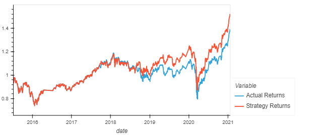
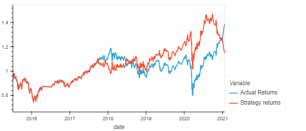
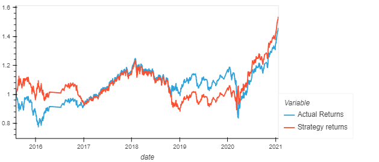

# Machine-Learning-Trading-Bot

---
## Implementing algorithmic trading signals by:

* Implementing an algorithmic trading strategy that uses machine learning to automate the trade decisions.

* Adjusting the input parameters to optimise the trading algorithm.

* Training a new machine learning model and compare its performance to that of a baseline model.
* A second notebook was added to analyse an Alternative model

Data Analysis

## Using the SVC classifier model from SKLearn's support vector machine (SVM) learning method
                  precision    recall  f1-score   support

        -1.0       0.43      0.04      0.07      1804
         1.0       0.56      0.96      0.71      2288

    accuracy                           0.55      4092
   macro avg       0.49      0.50      0.39      4092
weighted avg       0.50      0.55      0.43      4092

using a short window of 4 and long window of 100, offset by 3 months from the minimum date in the X feature resulted in a 55% accuracy in prediction. 

---

## Using the LogisticRegression Model from Scikit-learn resulted in the following report: 

                 precision    recall  f1-score   support

        -1.0       0.44      0.33      0.38      1804
         1.0       0.56      0.66      0.61      2288

    accuracy                           0.52      4092
   macro avg       0.50      0.50      0.49      4092
    weighted avg       0.51      0.52      0.51      4092

Using the LogisticRegression Model from Scikit-learn resulted in the following report: 
The parameters used are identical to the SCV classifier from above. The model accuracy slightly dropped. We however see an improvement in the -1.0 recall and precision indicative of better short term performance.
---

## Alternative use of LogisticRegression Model from Scikit-learn resulted in the following report:

                   precision    recall  f1-score   support

        -1.0       0.45      0.16      0.23      1779
         1.0       0.56      0.85      0.68      2270

    accuracy                           0.55      4049
   macro avg       0.51      0.50      0.45      4049
weighted avg       0.51      0.55      0.48      4049

A short window of 20 and long window of 100, offset by 4 months from the minimum date in the X feature resulted in a 55% accuracy in prediction. The model resulted in an overall improvement in precision as well as recall while maintaining a 55% accuracy. 

## Cumulative plot that shows the actual returns vs the strategy returns

### SVC Classifier

### LogisticRegression Model

### Alternative LogisticRegression Model with alternative parameters

## Conclusion 
Increasing the window size as well as time yielded better prediction results. Overall the Alternative LogisticRegression model did better than the other models. Ultimately, which model is best may depend on which class we care most about predicting, as well as which has better overall economic returns compared to a long-only investment.
